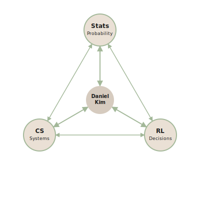

  

<h1 align="center">ARCHITECTING RELIABLE INTELLIGENCE THROUGH BAYESIAN FOUNDATIONS</h1>
<h3 align="center">Navigating the nexus of sequential decision-making and statistical rigour</h3>

---

## 🔬 Research Interests

My academic pursuit lies at the intersection of rigorous statistical inference and high-performance machine learning. I am dedicated to interrogating the structural guarantees of intelligent systems.

### Bayesian Reinforcement Learning
**Sample efficiency via uncertainty estimation & Variational inference.**

Interrogating the convergence of Bayesian statistics and reinforcement learning to maximise sample efficiency within high-dimensional state spaces. By transitioning beyond conventional point estimation, I am investigating the structural guarantees of uncertainty estimation. This entails leveraging variational inference for robust posterior approximation and quantifying epistemic uncertainty within a Variational Actor-Critic framework.

### Privacy-Preserving Offline RL
**Differential privacy guarantees & Machine unlearning in sequential decision-making.**

Exploring the structural guarantees of $(\epsilon, \delta)$-Differential Privacy within offline reinforcement learning, particularly concerning sensitive medical and financial logs. Rather than relying on naive noise injection, the objective is to architect utility-optimised mechanisms that negotiate the privacy-utility trade-off via precise optimisation under constraints. This encompasses integrating machine unlearning for efficient policy updates and ensuring robust policy evaluation under stringent privacy boundaries.

---

## 🎯 Current Focus

Rather than mere implementation, my current focus is directed towards interrogating fundamental academic questions:

* **Uncertainty Quantification:** How can we construct tight bounds on epistemic uncertainty to prevent catastrophic degradation in out-of-distribution state spaces?
* **Utility-Optimised Privacy:** To what extent can we integrate $(\epsilon, \delta)$-Differential Privacy into offline policy evaluation without compromising the convergence properties of the target policy?
* **Algorithmic Unlearning:** What are the theoretical prerequisites for provable machine unlearning in sequential decision-making paradigms, ensuring minimal computational overhead whilst maintaining model integrity?

---

## 📬 Contact Information

I welcome discourse with fellow researchers and practitioners regarding potential collaborations or theoretical discussions.

* **Email**: [coderpoirot@gmail.com](mailto:coderpoirot@gmail.com) / [daniel1kim@yonsei.ac.kr](mailto:daniel1kim@yonsei.ac.kr)
* **LinkedIn**: [danielkim-ai](https://www.linkedin.com/in/danielkim-ai/)
* **Portfolio**: [danielkim-ai.vercel.app](https://danielkim-ai.vercel.app)

 

  <small><em>"The ultimate prerogative of choice must remain anchored in human agency, ensuring accountability within the algorithmic framework."</em></small>

