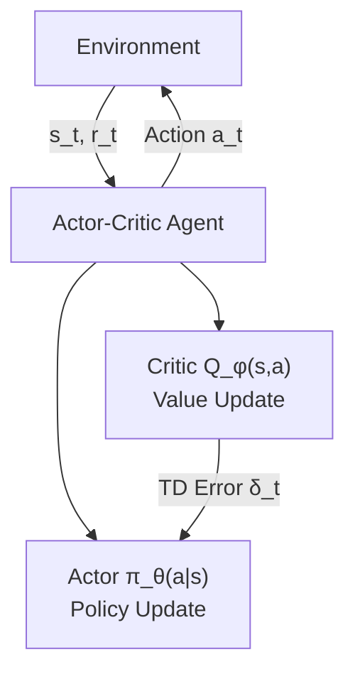

  Part of the CS285: Deep RL Series
  <nav className="series-banner__nav">
    <a href="/coursework/foundations-of-rl" className="series-banner__link">① Foundations of RL</a>
    ·
    <a href="/coursework/policy-gradient" className="series-banner__link">② Policy Optimisation & PPO</a>
    ·
    ③ Actor-Critic & SAC
    ·
    <a href="/coursework/offline-and-meta-rl" className="series-banner__link">④ Offline & Meta-RL</a>
  </nav>

## 1. The Actor-Critic Architecture

Actor-Critic methods decompose the RL objective into two complementary components:

- **Actor** $\pi_\theta(a \mid s)$: a parameterised policy that selects actions
- **Critic** $Q_\phi(s, a)$ or $V_\psi(s)$: a value estimator that evaluates the actor's decisions

This separation is motivated by the **high-variance problem** of pure policy gradient methods (REINFORCE), which use full Monte Carlo returns as the learning signal. By substituting the return with a learned value estimate, the critic provides a low-variance baseline, whilst the actor uses the critic's signal to improve policy parameters.

### Standard Actor-Critic Objective

The actor's gradient follows the **Policy Gradient Theorem** with a learned advantage:

$$
\nabla_\theta J(\theta) = \mathbb{E}_{(s,a) \sim \rho^\pi}\!\left[\nabla_\theta \log \pi_\theta(a \mid s) \cdot A^\pi(s, a)\right]
$$

where the advantage function $A^\pi(s,a) = Q^\pi(s,a) - V^\pi(s)$ reduces variance by centring the signal around the mean value.

---

## 2. Maximum Entropy Reinforcement Learning

Standard RL maximises expected return. **Maximum Entropy RL** augments this objective with a policy entropy bonus, yielding the **Soft RL** framework:

$$
J(\pi) = \mathbb{E}_{\tau \sim \pi}\!\left[\sum_{t=0}^{\infty} \gamma^t \Bigl(r(s_t, a_t) + \alpha \mathcal{H}\bigl(\pi(\cdot \mid s_t)\bigr)\Bigr)\right]
$$

where $\mathcal{H}(\pi(\cdot \mid s)) = -\mathbb{E}_{a \sim \pi}[\log \pi(a \mid s)]$ is the differential entropy of the policy and $\alpha > 0$ is the **temperature** hyperparameter that controls the entropy-reward trade-off.

### Motivation: Why Entropy Regularisation?

The entropy bonus confers several critical benefits:

1. **Improved Exploration**: The agent is explicitly rewarded for visiting diverse state-action pairs, preventing premature exploitation of locally optimal but globally suboptimal trajectories.
2. **Robustness**: Stochastic policies are inherently more robust to perturbations in environment dynamics (aleatoric uncertainty), as they do not concentrate probability mass on a single action.
3. **Multi-modality**: In reward landscapes with multiple equivalent optima, high-entropy policies maintain probability mass across all modes, whereas deterministic policies collapse onto a single mode arbitrarily.

---

## 3. Soft Actor-Critic (SAC)

**Soft Actor-Critic** (Haarnoja et al., 2018) is the state-of-the-art off-policy actor-critic algorithm that operationalises maximum entropy RL with remarkable sample efficiency.

### Soft Bellman Equations

SAC introduces **soft** versions of the value functions:

$$
Q_\text{soft}^\pi(s,a) = \mathbb{E}\!\left[\sum_{t \ge 0} \gamma^t \Bigl(r_t + \alpha \mathcal{H}\bigl(\pi(\cdot \mid s_{t+1})\bigr)\Bigr)\right]
$$

$$
V_\text{soft}^\pi(s) = \mathbb{E}_{a \sim \pi}\!\left[Q_\text{soft}^\pi(s,a) - \alpha \log \pi(a \mid s)\right]
$$

### SAC Training Objectives

SAC jointly trains three networks:

**Critic (Twin Q-networks to mitigate overestimation):**

$$
J_Q(\phi) = \mathbb{E}_{(s,a,r,s') \sim \mathcal{D}}\!\left[\Bigl(Q_\phi(s,a) - \bigl(r + \gamma \bar{V}(s')\bigr)\Bigr)^2\right]
$$

where $\bar{V}(s') = \mathbb{E}_{a' \sim \pi_\theta}\!\bigl[\min_{i=1,2} Q_{\phi_i}(s', a') - \alpha \log \pi_\theta(a' \mid s')\bigr]$ uses the minimum of two Q-networks.

**Actor (maximise soft Q-value):**

$$
J_\pi(\theta) = \mathbb{E}_{s \sim \mathcal{D},\, a \sim \pi_\theta}\!\Bigl[\alpha \log \pi_\theta(a \mid s) - \min_{i=1,2} Q_{\phi_i}(s,a)\Bigr]
$$

**Temperature (dual gradient descent on $\alpha$):**

$$
J(\alpha) = \mathbb{E}_{a \sim \pi_\theta}\!\bigl[-\alpha \log \pi_\theta(a \mid s) - \alpha \bar{\mathcal{H}}\bigr]
$$

where $\bar{\mathcal{H}}$ is the **target entropy** (typically set to $-|\mathcal{A}|$ for continuous action spaces).

---

## 4. Automatic Temperature Tuning

Manually tuning $\alpha$ is notoriously difficult — too high an entropy bonus incentivises pure exploration; too low collapses the stochastic policy to near-determinism. SAC elegantly automates this via a **dual optimisation**:

$$
\alpha^* = \arg\min_\alpha \mathbb{E}_{a \sim \pi^*}\!\bigl[-\alpha \log \pi^*(a \mid s;\alpha) - \alpha \bar{\mathcal{H}}\bigr]
$$

This objective drives $\alpha$ upward when the policy entropy is below $\bar{\mathcal{H}}$ and downward when above, maintaining the entropy at precisely the target level throughout training.

---

## 5. Hyperparameter Sensitivity Analysis

Despite SAC's relative robustness, performance is sensitive to several hyperparameter choices. The following analysis examines the principal axes of sensitivity in continuous MuJoCo control tasks.

### 5.1 Network Architecture & Learning Rates

| Hyperparameter | Typical Range | Impact |
|---|---|---|
| Hidden layers (actor/critic) | 2–3 × 256 | Underfitting vs. overparameterisation |
| Learning rate $\eta$ | $3 \times 10^{-4}$ | Instability if too large; slow convergence if too small |
| Replay buffer size $\vert\mathcal{D}\vert$ | $10^5$–$10^6$ | Critical for off-policy data diversity |
| Batch size | 256 | Gradient variance vs. computation |

### 5.2 Temperature Sensitivity

The entropy coefficient $\alpha$ (or its target $\bar{\mathcal{H}}$) exhibits the strongest per-task sensitivity:

- **HalfCheetah-v4**: Relatively insensitive — the dense reward signal naturally constrains the policy, making automatic tuning robust.
- **Humanoid-v4**: Highly sensitive — the sparse, high-dimensional reward signal requires precise entropy calibration to prevent both premature convergence (low $\alpha$) and perpetual exploration without locomotion (high $\alpha$).
- **Hopper-v4**: Bimodal sensitivity — moderate $\alpha$ enables learning to stand before learning to hop; extreme values collapse both phases.

### 5.3 Discount Factor $\gamma$

$$
\gamma \to 1 \implies \text{longer effective planning horizon, slower convergence, higher variance}
$$

$$
\gamma \ll 1 \implies \text{myopic policy, fast convergence, degraded long-term performance}
$$

Typical practice: $\gamma = 0.99$ for locomotion, $\gamma = 0.999$ for tasks requiring long-horizon credit assignment.

---

## 6. Comparison: SAC vs. TD3 vs. PPO

| Algorithm | On/Off-policy | Entropy Bonus | Deterministic Policy | Key Strength |
|---|---|---|---|---|
| SAC | Off-policy | Yes (automatic) | No (stochastic) | Sample efficiency, robustness |
| TD3 | Off-policy | No | Yes + noise | Stability, simple tuning |
| PPO | On-policy | Optional | No | Simplicity, reliable convergence |

SAC consistently achieves state-of-the-art sample efficiency in dense-reward continuous control, converging in approximately 1M environment steps versus PPO's 5–10M for equivalent final performance in Ant-v4 and HalfCheetah-v4.

