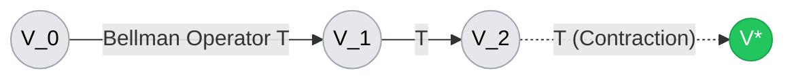
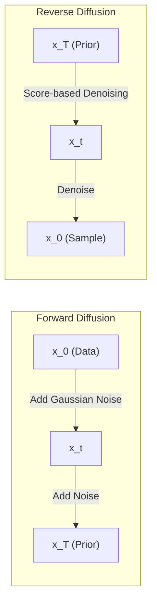

# CAS3230: INTRODUCTION TO MATHEMATICS FOR DEEPLEARNING (Instructor: Albert No)

## "Mathematical Rigor as a Foundation for Reliable Decision Intelligence"

## The Research Bridge

This module reframes mathematical foundations not as isolated abstractions, but as structural prerequisites for engineering reliable, privacy-aware Reinforcement Learning systems.

### [A] Sequential Decision Making & Stability (Ch 6, 20)

**Focus:** Random Process & Operator Theory.

**Bridge:** The cornerstone of Reinforcement Learning, the Bellman Equation, can be rigorously reinterpreted through the lens of the Banach Fixed Point Theorem detailed in Chapter 20. Crucially, within the domain of Offline RL, the insidious phenomenon of Distributional Shift fundamentally challenges the theoretical guarantees of this framework. By formally analysing the contraction mapping properties of the Bellman Operator, we can meticulously dissect precisely how and when these stability guarantees deteriorate under non-stationary distributions, thereby forging a mathematical path towards more robust offline policy evaluation techniques.

### [B] Bayesian RL & Uncertainty Quantification (Ch 8.2, 9)

**Focus:** MAP Estimation & Multivariate Gaussian.

**Bridge:** We bridge the imperative of efficient exploration in RL with the rigorous posterior estimation frameworks of Chapter 9. By leveraging the theoretical underpinnings of Gaussian distributions, we establish a robust paradigm for uncertainty quantification. Furthermore, drawing upon the Gaussian Diffusion concepts from Chapter 9.7, we formalise the mathematical equivalency between recent high-dimensional action space modelling in Offline RL via Diffusion Policies and the broader theoretical landscape of Score-based Generative Modelling.

### [C] Privacy-Driven RL & Model Efficiency (Ch 5.3, 14, 18)

**Focus:** Differential Entropy, Matrix Analysis(SVD), SGD Analysis.

**Bridge:** This segment explicitly aligns empirical methodologies, such as LR-Q-LR quantisation strategies, with the formal mathematical bounds of the Best Low-Rank Approximation (Eckart-Young-Mirsky Theorem) delineated in Chapter 14.4. Additionally, we cast the stringent privacy guarantees of $(\epsilon, \delta)$-Differential Privacy as an entropy-constrained optimisation problem, leveraging Chapter 5.3. This perspective facilitates a rigorous, closed-form mathematical analysis of the fundamental convergence-rate trade-offs inherent when injecting calibrated Laplacian or Gaussian noise into Stochastic Gradient Descent (SGD).

import QuantisationDiagram from '../../components/QuantisationDiagram.astro';

  <QuantisationDiagram />

## Mathematical Rigor

### Banach Fixed Point Theorem and the Bellman Operator

The optimal value function $V^*(s)$ is the unique fixed point of the Bellman optimality operator $\mathcal{T}$, defined as:
$$
(\mathcal{T}V)(s) = \max_a \left[ R(s, a) + \gamma \sum_{s'} P(s' | s, a) V(s') \right]
$$
By demonstrating that $\mathcal{T}$ is a $\gamma$-contraction mapping under the supremum norm $\| \cdot \|_\infty$, the Banach Fixed Point Theorem guarantees both the existence and uniqueness of $V^*$, as well as the convergence of Value Iteration.

### Low-Rank Approximation and Quantisation

Given a weight matrix $W \in \mathbb{R}^{m \times n}$, the Best Low-Rank Approximation theorem (Eckart-Young-Mirsky) states that the truncated SVD $W_k = U_k \Sigma_k V_k^T$ minimises the approximation error in the Frobenius norm:
$$
\min_{\text{rank}(X) \le k} \| W - X \|_F = \| W - W_k \|_F = \sqrt{\sum_{i=k+1}^{\min(m,n)} \sigma_i^2}
$$
This foundational theorem provides the rigorous mathematical justification for empirical quantisation methodologies like LR-Q-LR.

### Differential Privacy and Entropy

Differential Privacy ($\epsilon, \delta$-DP) ensures that the output distribution of a randomised algorithm $\mathcal{A}$ remains remarkably stable regardless of the inclusion or exclusion of any single data point. The privacy bounds can be intrinsically linked to the differential entropy $h(X)$ of the injected noise mechanism. For example, when bounding the privacy loss random variable, the Gaussian mechanism requires analysing the tail bounds, leveraging its well-defined entropy characteristics.

## Deep Dive

[View My Detailed Handwritten-style LaTeX Notes (131 Pages PDF)](/assets/CAS3230.pdf)
