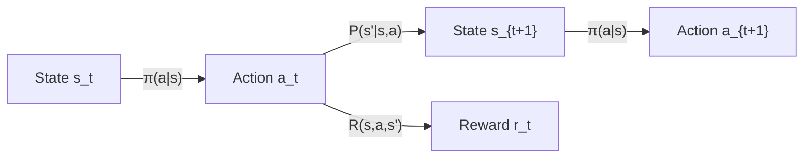

  Part of the CS285: Deep RL Series
  <nav className="series-banner__nav">
    ① Foundations of RL
    ·
    <a href="/coursework/policy-gradient" className="series-banner__link">② Policy Optimisation & PPO</a>
    ·
    <a href="/coursework/actor-critic-methods" className="series-banner__link">③ Actor-Critic & SAC</a>
    ·
    <a href="/coursework/offline-and-meta-rl" className="series-banner__link">④ Offline & Meta-RL</a>
  </nav>

## 1. Markov Decision Processes

A Markov Decision Process (MDP) provides the canonical mathematical framework for sequential decision-making under uncertainty. Formally, an MDP is a 5-tuple $\mathcal{M} = (\mathcal{S}, \mathcal{A}, \mathcal{P}, \mathcal{R}, \gamma)$, where:

- $\mathcal{S}$ — a (possibly continuous) state space
- $\mathcal{A}$ — an action space
- $\mathcal{P}(s' \mid s, a)$ — the transition kernel governing environment dynamics
- $\mathcal{R}(s, a, s')$ — the reward function mapping transitions to scalar signals
- $\gamma \in [0, 1)$ — the discount factor governing future reward weighting

The **Markov property** is the central structural assumption: the future is conditionally independent of the past given the present state, i.e., $P(s_{t+1} \mid s_t, a_t, \ldots, s_0, a_0) = P(s_{t+1} \mid s_t, a_t)$. This memoryless property renders the problem tractable.

### Value Functions

The **state-value function** under policy $\pi$ is defined as the expected discounted return from state $s$:

$$
V^\pi(s) = \mathbb{E}_\pi\!\left[\sum_{t=0}^{\infty} \gamma^t r_t \;\Big|\; s_0 = s\right]
$$

The **action-value function** (Q-function) additionally conditions on the initial action $a$:

$$
Q^\pi(s, a) = \mathbb{E}_\pi\!\left[\sum_{t=0}^{\infty} \gamma^t r_t \;\Big|\; s_0 = s,\, a_0 = a\right]
$$

The two are related by $V^\pi(s) = \mathbb{E}_{a \sim \pi(\cdot \mid s)}\bigl[Q^\pi(s,a)\bigr]$.

---

## 2. Bellman Equations

### Bellman Expectation Equation

The value functions satisfy a recursive consistency condition — the **Bellman Expectation Equation**:

$$
V^\pi(s) = \mathbb{E}_{a \sim \pi, s' \sim \mathcal{P}}\!\Bigl[r(s,a,s') + \gamma V^\pi(s')\Bigr]
$$

$$
Q^\pi(s,a) = \mathbb{E}_{s' \sim \mathcal{P}}\!\Bigl[r(s,a,s') + \gamma \mathbb{E}_{a' \sim \pi}\bigl[Q^\pi(s',a')\bigr]\Bigr]
$$

### Bellman Optimality Equation

The **optimal** value functions $V^*$ and $Q^*$ satisfy the non-linear Bellman Optimality Equations:

$$
V^*(s) = \max_{a \in \mathcal{A}} \mathbb{E}_{s' \sim \mathcal{P}}\!\bigl[r(s,a,s') + \gamma V^*(s')\bigr]
$$

$$
Q^*(s, a) = \mathbb{E}_{s' \sim \mathcal{P}}\!\Bigl[r(s,a,s') + \gamma \max_{a'} Q^*(s', a')\Bigr]
$$

The optimal policy is then recovered greedily: $\pi^*(s) = \arg\max_a Q^*(s,a)$.

### Contraction Mapping and Convergence

Define the **Bellman Optimality Operator** $\mathcal{T}^*$ acting on a value function $V$:

$$
(\mathcal{T}^* V)(s) = \max_a \mathbb{E}_{s'}\!\bigl[r(s,a,s') + \gamma V(s')\bigr]
$$

By the **Banach Fixed-Point Theorem**, $\mathcal{T}^*$ is a $\gamma$-contraction in the $\ell^\infty$ norm:

$$
\|\mathcal{T}^* V - \mathcal{T}^* U\|_\infty \le \gamma \|V - U\|_\infty
$$

Since $\gamma < 1$, iterating $\mathcal{T}^*$ from any initialisation converges uniquely to $V^*$ — the theoretical guarantee underlying Dynamic Programming.

---

## 3. Q-Learning

Q-Learning is a **model-free**, off-policy algorithm that directly estimates $Q^*$ via temporal difference (TD) updates. Given a transition $(s_t, a_t, r_t, s_{t+1})$, the update rule is:

$$
Q(s_t, a_t) \;\leftarrow\; Q(s_t, a_t) + \alpha \underbrace{\Bigl[r_t + \gamma \max_{a'} Q(s_{t+1}, a') - Q(s_t, a_t)\Bigr]}_{\text{TD Error } \delta_t}
$$

where $\alpha \in (0,1]$ is the learning rate.

### Convergence Conditions

Under the **Robbins-Monro conditions** on the learning rate schedule — $\sum_t \alpha_t = \infty$ and $\sum_t \alpha_t^2 < \infty$ — and with each $(s,a)$ pair visited infinitely often, tabular Q-Learning provably converges to $Q^*$.

### Deep Q-Networks (DQN)

When the state space is continuous, $Q(s, a; \theta)$ is parameterised by a neural network. The training objective minimises the **mean-squared Bellman error**:

$$
\mathcal{L}(\theta) = \mathbb{E}_{(s,a,r,s') \sim \mathcal{D}}\!\left[\Bigl(r + \gamma \max_{a'} Q(s', a';\, \theta^-) - Q(s, a;\, \theta)\Bigr)^2\right]
$$

Key stabilisation techniques introduced by Mnih et al. (2015):
- **Experience Replay** $\mathcal{D}$: breaks temporal correlations by sampling mini-batches from a circular buffer
- **Target Network** $\theta^-$: a periodically-copied frozen copy of $\theta$ that stabilises the regression target

---

## 4. Summary Diagram: DP vs. TD vs. MC

| Method | Model? | Bootstrapping? | Update Scope |
|---|---|---|---|
| Dynamic Programming | ✓ | ✓ | Full backup over all states |
| Monte Carlo | ✗ | ✗ | Full episode return |
| TD Learning (Q-Learning) | ✗ | ✓ | One-step TD error $\delta_t$ |

The key insight: **TD methods combine the tractability of DP (bootstrapping) with the model-free nature of Monte Carlo**, making them the computational backbone of modern deep RL.
