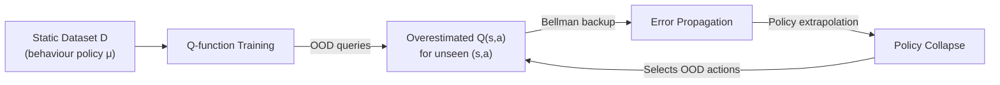

  Part of the CS285: Deep RL Series
  <nav className="series-banner__nav">
    <a href="/coursework/foundations-of-rl" className="series-banner__link">① Foundations of RL</a>
    ·
    <a href="/coursework/policy-gradient" className="series-banner__link">② Policy Optimisation & PPO</a>
    ·
    <a href="/coursework/actor-critic-methods" className="series-banner__link">③ Actor-Critic & SAC</a>
    ·
    ④ Offline & Meta-RL
  </nav>

## 1. The Offline Reinforcement Learning Problem

In **offline (batch) RL**, the agent must learn a policy exclusively from a static, pre-collected dataset $\mathcal{D} = \{(s, a, r, s')\}$ generated by some **behaviour policy** $\mu(a \mid s)$. Unlike online RL, no further environment interaction is permitted during training. This setting is of paramount practical importance in safety-critical domains (healthcare, robotics, autonomous driving) where online exploration incurs unacceptable risk.

### The Central Challenge: Distributional Shift

The core difficulty is that any reasonably good policy $\pi$ will visit state-action pairs $(s, a)$ that were **not** covered by $\mu$ in the dataset — so-called **out-of-distribution (OOD)** actions. When a standard Q-function trained on $\mathcal{D}$ is queried at OOD $(s,a)$ pairs, it produces **extrapolation error**: arbitrarily large (and incorrect) Q-values.

The Bellman backup then propagates these errors recursively:

$$
Q^\pi(s,a) \approx r(s,a) + \gamma \mathbb{E}_{s'}\!\left[\max_{a'} Q^\pi(s', a')\right]
$$

Because $\pi$ selects $a' = \arg\max_{a'} Q(s', a')$, it preferentially queries the most overestimated Q-values, creating a **positive feedback loop** that drives policy performance to collapse.

### Quantifying the Shift

Let $d^\pi(s,a)$ be the state-action visitation distribution of the learned policy, and $d^\mu(s,a)$ that of the behaviour policy. The **distributional shift** magnitude is measured by their divergence:

$$
\mathcal{D}_\text{shift} = D_\text{TV}\bigl(d^\pi \,\|\, d^\mu\bigr) \quad \text{or} \quad D_\text{KL}\bigl(d^\pi \,\|\, d^\mu\bigr)
$$

Standard offline RL bounds (e.g., from Levine et al., 2020) show that policy performance degrades proportionally to $\mathcal{D}_\text{shift}$:

$$
J(\pi) - J(\hat{\pi}) \le \frac{2\gamma r_{\max}}{(1-\gamma)^2} \cdot \mathbb{E}_{s \sim d^\pi}\!\left[D_\text{TV}\bigl(\pi(\cdot \mid s) \,\|\, \mu(\cdot \mid s)\bigr)\right]
$$

---

## 2. Conservative Q-Learning (CQL)

**Conservative Q-Learning** (Kumar et al., 2020) addresses distributional shift by augmenting the standard Bellman objective with a **conservatism penalty** that explicitly suppresses Q-values at OOD actions whilst raising them at actions covered by the dataset.

### CQL Objective

$$
\min_Q \; \underbrace{\frac{1}{2}\mathbb{E}_{(s,a,s') \sim \mathcal{D}}\!\left[\bigl(Q(s,a) - \mathcal{T}^\pi Q(s,a)\bigr)^2\right]}_{\text{Standard Bellman Error}}
\;+\; \alpha_\text{CQL} \underbrace{\left(\mathbb{E}_{s \sim \mathcal{D},\, a \sim \mu_\phi}\!\bigl[Q(s,a)\bigr] - \mathbb{E}_{(s,a) \sim \mathcal{D}}\!\bigl[Q(s,a)\bigr]\right)}_{\text{Conservative Penalty}}
$$

The penalty term achieves two effects simultaneously:
- **Minimises** $\mathbb{E}_{a \sim \mu_\phi}[Q(s,a)]$: pushes down Q-values at actions sampled from some sampling distribution $\mu_\phi$ (often the current policy or a uniform distribution)
- **Maximises** $\mathbb{E}_{(s,a) \sim \mathcal{D}}[Q(s,a)]$: pushes up Q-values at dataset actions, preserving their accuracy

### CQL Guarantees

CQL provides a **lower bound** guarantee: the learned Q-function $\hat{Q}^\pi$ satisfies:

$$
\hat{Q}^\pi(s,a) \le Q^\pi(s,a) \quad \forall\, (s,a) \in \mathcal{S} \times \mathcal{A}
$$

This under-estimation bias is deliberate — it prevents the policy from exploiting spuriously high Q-values at OOD actions, at the cost of conservative (but safe) policy improvement.

### CQL-H: The Practical Variant

In practice, the sampling distribution $\mu_\phi$ is set to the **current policy** $\pi_\theta$, yielding CQL-H (the version used with SAC):

$$
J_\text{CQL}(Q) = \alpha_\text{CQL} \left(\log \sum_a \exp Q(s,a) - \mathbb{E}_{a \sim \mathcal{D}}[Q(s,a)]\right) + \frac{1}{2}\mathbb{E}_\mathcal{D}\!\left[(Q - \mathcal{T}^\pi Q)^2\right]
$$

Note the **log-sum-exp** term: this is the soft-maximum over all actions, making the penalty differentiable without requiring an explicit enumeration of the action space.

---

## 3. Dataset Coverage and the Role of $\alpha_\text{CQL}$

The CQL penalty coefficient $\alpha_\text{CQL}$ controls the conservatism-performance trade-off:

| $\alpha_\text{CQL}$ | Effect |
|---|---|
| $\to 0$ | Recovers standard Q-Learning; no protection against OOD extrapolation |
| Small | Mild conservatism; effective when dataset coverage is broad |
| Large | Strong conservatism; essential for narrow, suboptimal datasets; may under-perform with diverse datasets |

The optimal $\alpha_\text{CQL}$ scales with the **inverse of dataset coverage**: tasks with narrow behaviour policies (e.g., `hopper-medium-v2`) require substantially higher $\alpha_\text{CQL}$ than tasks with diverse exploratory datasets (e.g., `hopper-random-v2`).

---

## 4. Meta-Reinforcement Learning

Meta-RL addresses a distinct but related challenge: learning a **learning algorithm** itself, enabling rapid adaptation to new tasks with minimal experience. The canonical formulation is:

$$
\max_\theta \; \mathbb{E}_{\mathcal{T} \sim p(\mathcal{T})}\!\left[J_\mathcal{T}\bigl(f_\theta(\mathcal{D}_\mathcal{T}^{\text{train}})\bigr)\right]
$$

where $f_\theta$ is the meta-learned adaptation procedure, and $\mathcal{D}_\mathcal{T}^{\text{train}}$ is a small support set from task $\mathcal{T}$.

### MAML: Model-Agnostic Meta-Learning

**MAML** (Finn et al., 2017) learns an initialisation $\theta$ such that a **single gradient step** on a new task's loss yields strong performance:

$$
\phi_\mathcal{T} = \theta - \alpha \nabla_\theta \mathcal{L}_\mathcal{T}(\theta) \qquad \text{(inner loop: task adaptation)}
$$

$$
\theta \leftarrow \theta - \beta \nabla_\theta \sum_{\mathcal{T}} \mathcal{L}_\mathcal{T}(\phi_\mathcal{T}) \qquad \text{(outer loop: meta-update)}
$$

The outer loop requires differentiating through the inner loop update — i.e., computing **second-order gradients** $\nabla_\theta^2 \mathcal{L}$. In practice, first-order approximations (FOMAML, Reptile) are often used for computational tractability.

### Connection to Offline RL

Meta-RL and offline RL share a fundamental connection: both must generalise from a **fixed set of trajectories** to unseen test conditions. In **offline meta-RL** (e.g., MACAW, MOPO), a dataset of trajectories from multiple training tasks is used to meta-learn a policy that can quickly adapt to new tasks — without any online interaction at meta-test time.

---

## 5. Benchmark: D4RL Performance Summary

The **D4RL** (Justin Fu et al., 2020) benchmark standardises offline RL evaluation across dataset quality levels:

| Algorithm | `hopper-medium` | `hopper-medium-expert` | `ant-medium` |
|---|---|---|---|
| Behavioural Cloning | 52.5 | 58.5 | 30.1 |
| CQL | **86.6** | **111.0** | **72.5** |
| TD3+BC | 59.3 | 91.5 | 48.3 |
| IQL | 66.3 | 91.4 | 47.4 |

CQL demonstrates consistently strong performance, particularly on narrow datasets where conservatism is essential. The `hopper-medium-expert` score exceeding 100 indicates that CQL surpasses the performance of the expert data's own policy — a testament to its capacity to stitch together suboptimal trajectories into super-expert behaviour.
