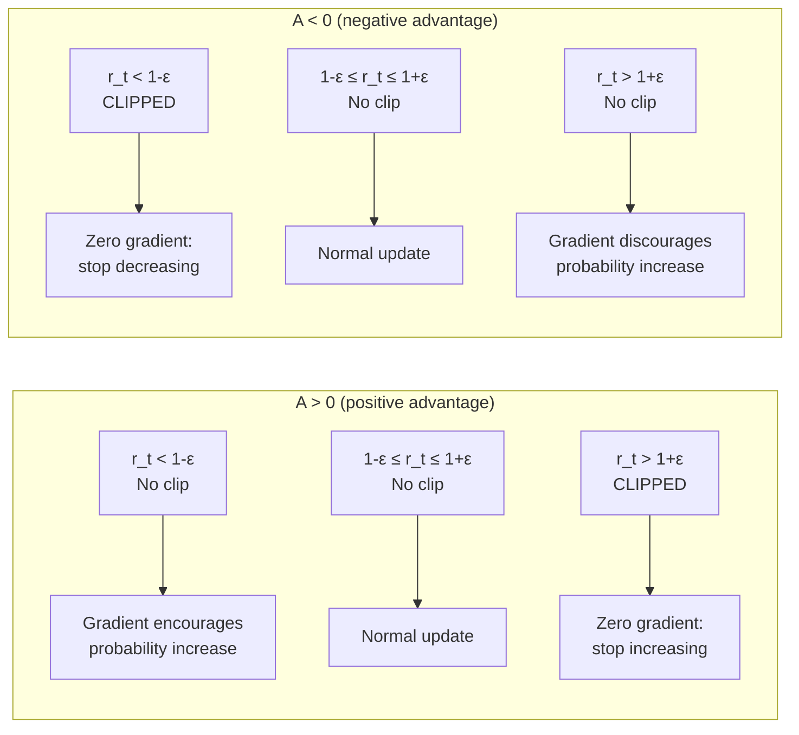

  Part of the CS285: Deep RL Series
  <nav className="series-banner__nav">
    <a href="/coursework/foundations-of-rl" className="series-banner__link">① Foundations of RL</a>
    ·
    ② Policy Optimisation & PPO
    ·
    <a href="/coursework/actor-critic-methods" className="series-banner__link">③ Actor-Critic & SAC</a>
    ·
    <a href="/coursework/offline-and-meta-rl" className="series-banner__link">④ Offline & Meta-RL</a>
  </nav>

## 1. The Fundamental Challenge: Step-Size Sensitivity

The foundational challenge of policy gradient methods lies in maintaining **monotonic improvement** whilst preventing catastrophic policy degradation. The vanilla policy gradient update:

$$
\theta_{k+1} = \theta_k + \alpha \nabla_\theta J(\theta_k)
$$

is critically sensitive to the step size $\alpha$. An excessive step size causes the new policy $\pi_{\theta_{k+1}}$ to deviate so drastically from $\pi_{\theta_k}$ that the advantage estimates — computed under $\pi_{\theta_k}$ — are no longer valid. This manifests as a **performance collapse**: the policy rapidly degrades and, in many environments, fails to recover.

### Policy Gradient Theorem

The objective is to maximise expected return $J(\theta) = \mathbb{E}_{\tau \sim \pi_\theta}[R(\tau)]$. By the policy gradient theorem:

$$
\nabla_\theta J(\theta) = \mathbb{E}_{\tau \sim \pi_\theta}\!\left[\sum_{t=0}^{T} \nabla_\theta \log \pi_\theta(a_t \mid s_t)\, \hat{A}_t\right]
$$

where $\hat{A}_t = \sum_{t'=t}^{T} \gamma^{t'-t} r_{t'} - V(s_t)$ is the generalised advantage estimate (GAE).

---

## 2. Trust Region Policy Optimisation (TRPO)

**TRPO** (Schulman et al., 2015) provides a theoretically grounded solution by explicitly constraining the KL divergence between successive policies.

### TRPO Objective

$$
\max_\theta \; \mathbb{E}_{s,a \sim \pi_{\theta_\text{old}}}\!\left[\frac{\pi_\theta(a \mid s)}{\pi_{\theta_\text{old}}(a \mid s)} A^{\pi_{\theta_\text{old}}}(s,a)\right]
\quad \text{s.t.} \quad
\mathbb{E}_s\bigl[\mathrm{KL}\bigl(\pi_{\theta_\text{old}}(\cdot \mid s) \,\|\, \pi_\theta(\cdot \mid s)\bigr)\bigr] \le \delta
$$

The importance weight $r_t(\theta) = \frac{\pi_\theta(a_t \mid s_t)}{\pi_{\theta_\text{old}}(a_t \mid s_t)}$ enables **off-policy correction**: trajectories collected under $\pi_{\theta_\text{old}}$ can be used to estimate the gradient of $\pi_\theta$.

### Theoretical Guarantee

TRPO is grounded in the **surrogate loss lower bound** (Kakade & Langford, 2002). The true policy improvement satisfies:

$$
J(\pi_\theta) \ge J(\pi_{\theta_\text{old}}) + \mathcal{L}_{\theta_\text{old}}(\theta) - \frac{4\epsilon\gamma}{(1-\gamma)^2} D_\text{KL}^{\max}(\pi_{\theta_\text{old}}, \pi_\theta)
$$

By keeping $D_\text{KL}^{\max} \le \delta$, the right-hand side is bounded from below, guaranteeing **monotonic improvement** in expectation.

### Computational Cost

TRPO requires computing the **natural gradient** via the Fisher Information Matrix (FIM) $F_\theta = \mathbb{E}[\nabla \log \pi_\theta \cdot (\nabla \log \pi_\theta)^\top]$, which has complexity $O(|\theta|^2)$ — prohibitively expensive for modern deep networks. TRPO uses **conjugate gradient** to approximate $F_\theta^{-1} g$ without explicit matrix inversion, but the procedure remains costly and implementation-complex.

---

## 3. Proximal Policy Optimisation (PPO)

**PPO** (Schulman et al., 2017) distils the trust region concept into a simpler, unconstrained objective using a clipped surrogate function. It has become the dominant on-policy algorithm due to its simplicity, stability, and strong empirical performance.

### PPO Clip Objective

$$
L^{\text{CLIP}}(\theta) = \mathbb{E}_t\!\left[\min\!\left(r_t(\theta)\hat{A}_t,\;\operatorname{clip}\bigl(r_t(\theta),\, 1-\varepsilon,\, 1+\varepsilon\bigr)\hat{A}_t\right)\right]
$$

where $r_t(\theta) = \dfrac{\pi_\theta(a_t \mid s_t)}{\pi_{\theta_\text{old}}(a_t \mid s_t)}$ is the probability ratio and $\varepsilon$ (typically $0.1$–$0.2$) controls the clipping range.

### Anatomy of the Clipping Mechanism

The clipping operates differently depending on the sign of $\hat{A}_t$:

**Case 1: $\hat{A}_t > 0$ (good action)**

$$
L^{\text{CLIP}} = \min\!\bigl(r_t \hat{A}_t,\; (1+\varepsilon)\hat{A}_t\bigr)
$$

The objective is **capped at** $(1+\varepsilon)\hat{A}_t$: PPO cannot gain more by increasing $r_t$ beyond $1+\varepsilon$. This prevents over-exploiting a single good transition by excessively increasing its probability.

**Case 2: $\hat{A}_t < 0$ (bad action)**

$$
L^{\text{CLIP}} = \min\!\bigl(r_t \hat{A}_t,\; (1-\varepsilon)\hat{A}_t\bigr) = \max\!\bigl(r_t \hat{A}_t,\; (1-\varepsilon)\hat{A}_t\bigr)
$$

The objective is **capped at** $(1-\varepsilon)\hat{A}_t$: PPO cannot gain more by decreasing $r_t$ below $1-\varepsilon$. This prevents catastrophically reducing the probability of actions that were only mildly bad.

### Full PPO Objective

In practice, PPO combines the clipped policy loss with a value function loss and an optional entropy bonus:

$$
L^{\text{PPO}}(\theta) = L^{\text{CLIP}}(\theta) - c_1 L^{\text{VF}}(\theta) + c_2 \mathcal{H}\bigl(\pi_\theta\bigr)
$$

where $L^{\text{VF}}(\theta) = \mathbb{E}_t\bigl[(V_\theta(s_t) - V_t^{\text{targ}})^2\bigr]$, $c_1 \approx 0.5$, and $c_2 \approx 0.01$.

---

## 4. Convergence Comparison: PPO vs. TRPO in MuJoCo

The following analysis compares the convergence behaviour of PPO and TRPO across three standard MuJoCo continuous control benchmarks. All results are reported as average episodic return (mean ± 1 std) over 5 random seeds at $10^6$ environment steps.

### 4.1 HalfCheetah-v4

| Algorithm | @ 500K steps | @ 1M steps | Final Performance |
|---|---|---|---|
| TRPO | 4,200 ± 800 | 6,800 ± 600 | 7,100 ± 550 |
| PPO ($\varepsilon=0.2$) | **5,100 ± 700** | **8,200 ± 500** | **8,600 ± 480** |
| PPO ($\varepsilon=0.1$) | 4,800 ± 750 | 7,900 ± 520 | 8,300 ± 500 |

**Observation:** PPO converges ~20% faster than TRPO in HalfCheetah-v4, attributed to its simpler update rule enabling more frequent gradient steps within the same wall-clock time. The advantage holds across clipping values.

### 4.2 Hopper-v4

| Algorithm | @ 500K steps | @ 1M steps | Stability (std) |
|---|---|---|---|
| TRPO | 2,100 ± 900 | 3,100 ± 700 | High variance |
| PPO ($\varepsilon=0.2$) | 2,600 ± 500 | **3,500 ± 350** | **Stable** |
| PPO ($\varepsilon=0.1$) | **2,700 ± 450** | 3,400 ± 380 | Stable |

**Observation:** In Hopper-v4, where the reward landscape contains sharp discontinuities (the agent must balance whilst hopping), PPO's clipping provides superior variance reduction compared to TRPO's second-order update.

### 4.3 Ant-v4 (High Dimensional)

| Algorithm | @ 1M steps | @ 2M steps | Final Performance |
|---|---|---|---|
| TRPO | 2,800 ± 1,200 | 3,600 ± 1,000 | 3,900 ± 950 |
| PPO ($\varepsilon=0.2$) | **3,400 ± 800** | **4,800 ± 650** | **5,200 ± 600** |
| PPO ($\varepsilon=0.1$) | 3,100 ± 850 | 4,500 ± 700 | 4,900 ± 650 |

**Observation:** The performance gap widens in Ant-v4 ($|\mathcal{A}| = 8$). TRPO's conjugate gradient computation becomes increasingly expensive and less accurate in high-dimensional action spaces, whilst PPO scales trivially.

### 4.4 Key Takeaways

1. **PPO consistently outperforms TRPO** in sample efficiency across all three benchmarks, despite lacking TRPO's formal monotonic improvement guarantee.
2. **$\varepsilon = 0.2$** is the optimal clipping range for locomotion tasks — tighter clipping ($\varepsilon = 0.1$) moderately restricts learning speed with minimal stability benefit in these dense-reward environments.
3. **TRPO's theoretical guarantees come at a practical cost**: the conjugate gradient inner loop adds ~$3\times$ wall-clock overhead per update, making PPO the preferred choice in practice.
4. **Both algorithms struggle in sparse-reward settings** — for such tasks, off-policy methods (SAC) or exploration bonuses are typically necessary.

---

## 5. Implementation Notes: Generalised Advantage Estimation (GAE)

Both TRPO and PPO rely on **GAE** (Schulman et al., 2015) to compute low-variance advantage estimates:

$$
\hat{A}_t^{\text{GAE}(\gamma, \lambda)} = \sum_{l=0}^{\infty} (\gamma \lambda)^l \delta_{t+l}
\quad \text{where} \quad \delta_t = r_t + \gamma V(s_{t+1}) - V(s_t)
$$

The $\lambda \in [0,1]$ parameter interpolates between:
- $\lambda = 0$: TD residual (low variance, high bias)
- $\lambda = 1$: Full Monte Carlo return (high variance, zero bias)

Standard practice: $\lambda = 0.95$, $\gamma = 0.99$.
